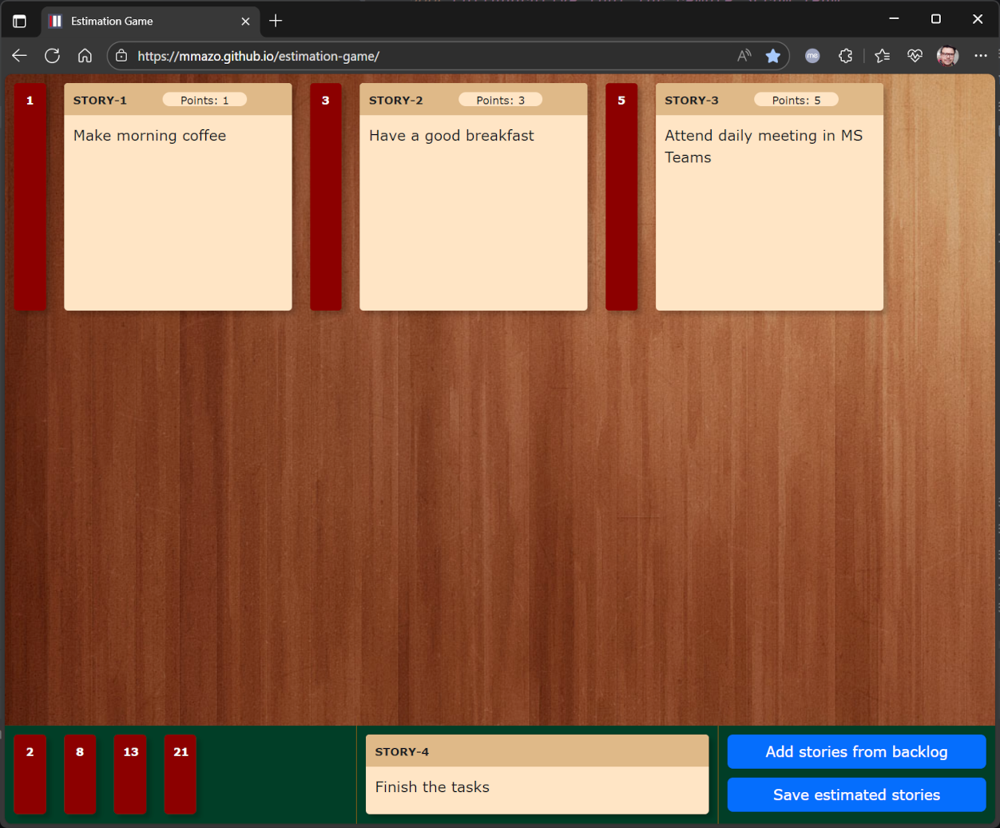

## Estimation Game

Is a small interactive tool based on the [Team Estimation Game](https://transferio.at/agile-coach/effizient-schaetzen-mit-dem-team-estimation-game/). 
Team Estimation Game is an alternative to the classic Planning Poker 
and allows Scrum Team to estimate many backlog items at once and in comparison to each other.

### Collaborative tool for remote Scrum Team 

Estimation game has proved to be especially useful for remote planning games. In time of Corona Home Office, such an option is specifically interesting. 
Since the app is not a service and has no backend, one team member (probably scrum master) can be the host, 
start the tool on his / her machine and share it via video call with other team members.
The host manages the game and moves the backlog items and estimation point partitions according to commands of other team members.   

### Paper-saving alternative for a planning game in office

Estimation game tool can be used on touch screen monitors and turn the planning game in a kind of "Minority report" interaction game :)
It also allows you to save paper and time, since you do not have to prepare the estimation cards and write down the results afterwards.

### Usage

0. Write down the backlog items in your notepad in following format:
   `STORY-NUMBER-1 Story title 1`
   `STORY-NUMBER-2 Story title 2`
   `STORY-NUMBER-3 Story title 3`
1. Start the app
2. Add stories from backlog by pressing on button "Add stories from backlog" in bottom right corner.
   A modal dialogue opens. You can now add multiple stories at once when switching to "Add multiple stories".
   Paste the backlog items from notepad, press "Add" and close modal dialogue.
   Backlog items appear in the bottom middle section in baklog items stack, where only the top item is shown.
3. Drag and drop backlog items from backlog item stack to the estimation area (grey field). You can re-arrange the items
   by dragging them around.
4. Drag and drop the estimation point partitions to the estimation area. You can rea-arrange them by dragging around.
   The story points for backlog items are adjusted automatically.
5. When finished, press "Save estimated stories". You will get the text file with the list of estimated backlog items.
   That`s it :)
   
### Live Example
You can find live example at [https://mmazo.github.io/estimation-game/](https://mmazo.github.io/estimation-game/)