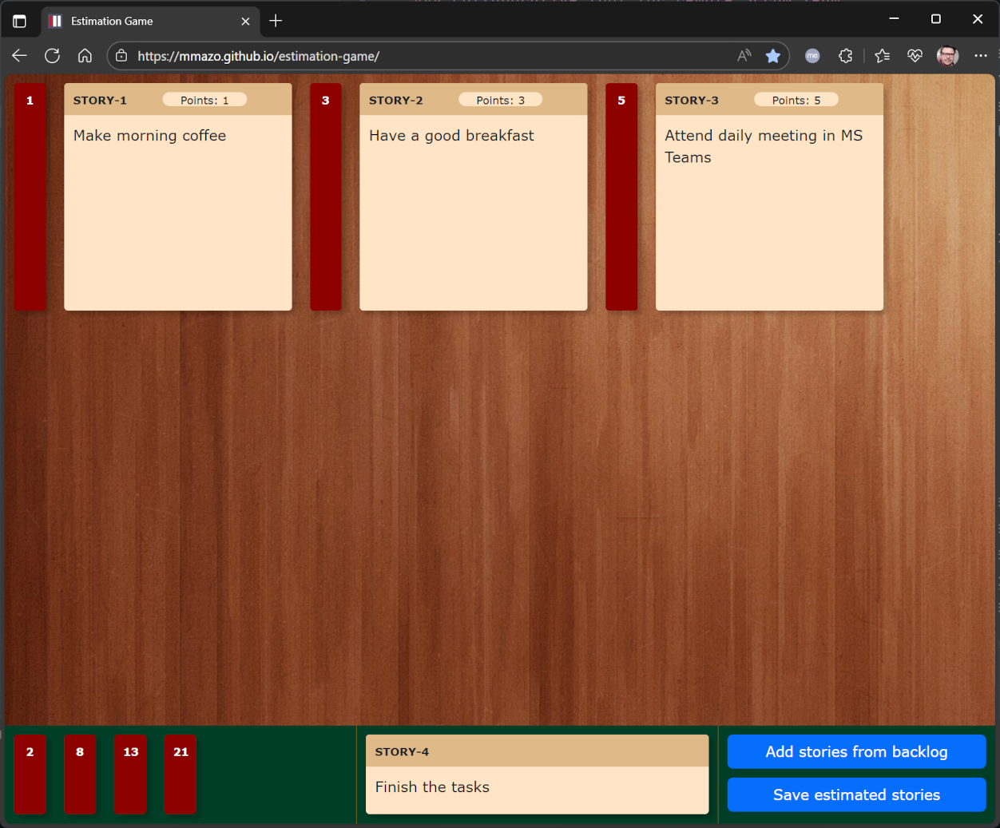

This project was bootstrapped with [Create React App](https://github.com/facebook/create-react-app).

## Estimation Game

Is a small interactive tool based on the [Team Estimation Game](https://transferio.at/agile-coach/effizient-schaetzen-mit-dem-team-estimation-game/). 
Team Estimation Game is an alternative to the classic Planning Poker 
and allows Scrum Team to estimate many backlog items at once and in comparison to each other.

### Collaborative tool for remote Scrum Team 

Estimation game has proved to be especially useful for remote planning games. In time of Corona Home Office, such an option is specifically interesting. 
Since the app is not a service and has no backend, one team member (probably scrum master) can be the host, 
start the tool on his / her machine and share it via video call with other team members.
The host manages the game and moves the backlog items and estimation point partitions according to commands of other team members.   

### Paper-saving alternative for a planning game in office

Estimation game tool can be used on touch screen monitors and turn the planning game in a kind of "Minority report" interaction game :)
It also allows you to save paper and time, since you do not have to prepare the estimation cards and write down the results afterwards.

### Usage

0. Write down the backlog items in your notepad in following format:
   `STORY-NUMBER-1 Story title 1`
   `STORY-NUMBER-2 Story title 2`
   `STORY-NUMBER-3 Story title 3`
1. Start the app
2. Add stories from backlog by pressing on button "Add stories from backlog" in bottom right corner.
   A modal dialogue opens. You can now add multiple stories at once when switching to "Add multiple stories".
   Paste the backlog items from notepad, press "Add" and close modal dialogue.
   Backlog items appear in the bottom middle section in baklog items stack, where only the top item is shown.
3. Drag and drop backlog items from backlog item stack to the estimation area (grey field). You can re-arrange the items
   by dragging them around.
4. Drag and drop the estimation point partitions to the estimation area. You can rea-arrange them by dragging around.
   The story points for backlog items are adjusted automatically.
5. When finished, press "Save estimated stories". You will get the text file with the list of estimated backlog items.
   That`s it :)
   
### Live Example
You can find live example at [https://mmazo.github.io/estimation-game/](https://mmazo.github.io/estimation-game/)

## Available Scripts

In the project directory, you can run:

### `npm start`

Runs the app in the development mode. 
Open [http://localhost:3000](http://localhost:3000) to view it in the browser.

The page will reload if you make edits. 
You will also see any lint errors in the console.

### `npm test`

Launches the test runner in the interactive watch mode. 
See the section about [running tests](https://facebook.github.io/create-react-app/docs/running-tests) for more information.

### `npm run build`

Builds the app for production to the `build` folder. 
It correctly bundles React in production mode and optimizes the build for the best performance.

The build is minified and the filenames include the hashes. 
Your app is ready to be deployed!

See the section about [deployment](https://facebook.github.io/create-react-app/docs/deployment) for more information.

### `npm run eject`

**Note: this is a one-way operation. Once you `eject`, you can’t go back!**

If you aren’t satisfied with the build tool and configuration choices, you can `eject` at any time. This command will remove the single build dependency from your project.

Instead, it will copy all the configuration files and the transitive dependencies (Webpack, Babel, ESLint, etc) right into your project so you have full control over them. All of the commands except `eject` will still work, but they will point to the copied scripts so you can tweak them. At this point you’re on your own.

You don’t have to ever use `eject`. The curated feature set is suitable for small and middle deployments, and you shouldn’t feel obligated to use this feature. However we understand that this tool wouldn’t be useful if you couldn’t customize it when you are ready for it.

## Learn More

You can learn more in the [Create React App documentation](https://facebook.github.io/create-react-app/docs/getting-started).

To learn React, check out the [React documentation](https://reactjs.org/).

### Code Splitting

This section has moved here: https://facebook.github.io/create-react-app/docs/code-splitting

### Analyzing the Bundle Size

This section has moved here: https://facebook.github.io/create-react-app/docs/analyzing-the-bundle-size

### Making a Progressive Web App

This section has moved here: https://facebook.github.io/create-react-app/docs/making-a-progressive-web-app

### Advanced Configuration

This section has moved here: https://facebook.github.io/create-react-app/docs/advanced-configuration

### Deployment

This section has moved here: https://facebook.github.io/create-react-app/docs/deployment

### `npm run build` fails to minify

This section has moved here: https://facebook.github.io/create-react-app/docs/troubleshooting#npm-run-build-fails-to-minify
